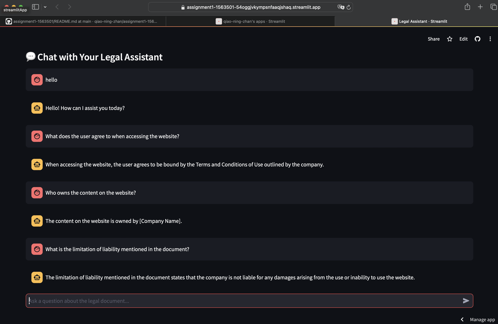

# assignment1-1563501

## Overview

This application allows users to upload legal documents and ask questions about them. The app uses a vectorized database to split the document into manageable chunks and integrates with the OpenAI GPT model to generate accurate responses based on the document's content.

## Deployed Application URL

The application is deployed and accessible at:

[**Deployed App URL**](https://assignment1-1563501-54oggjvkympsnfaaqjshaq.streamlit.app)

## Instructions

1. Enter your own OpenAI API key
2. Upload a legal document in `.txt` or `.docx` format.
3. Ask questions related to the content of the uploaded document.
4. The AI will search the document and provide answers based on the relevant sections of the text.

## Test Case

### Test Document: terms.txt
Title: Terms and Conditions of Use

1. Acceptance of Terms
By accessing or using this website, you agree to be bound by these Terms and Conditions of Use.

2. Intellectual Property
All content on this website, including text, images, and software, is the property of [Company Name] and is protected by copyright laws.

3. User Conduct
Users agree not to use the website for any unlawful purpose or any purpose prohibited by these Terms.

5. Limitation of Liability
The Company is not liable for any damages arising from the use or inability to use the website.

7. Governing Law
These Terms and Conditions are governed by the laws of the State of New York.

### Test Case Screenshot

